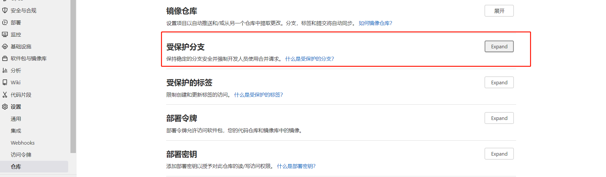
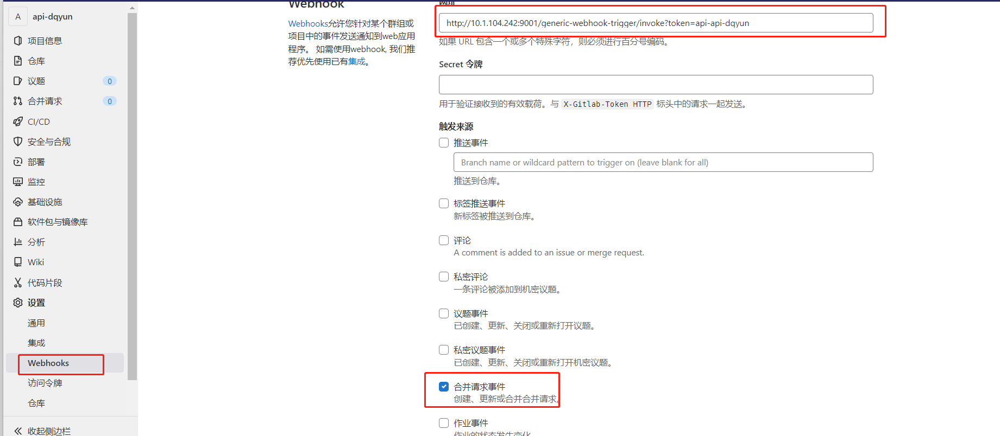
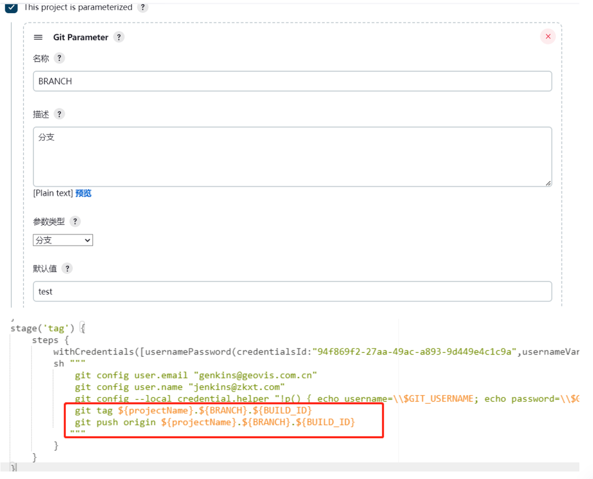
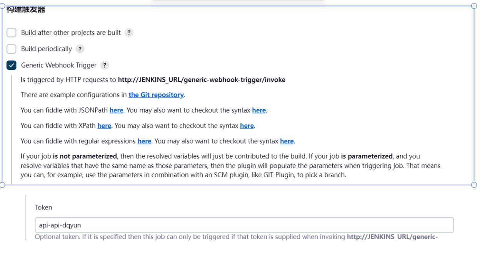

# Jenkins

## 一、地址
http://10.1.104.246:9001 （dqadmin/admin123）

## 二、快速部署（基于docker）
> Jenkins需要依赖环境Java、git、Maven、node
> 安装插件 GitLab  /  Publish Over SSH

***镜像中已安装了node***

> 制作node镜像的Dockerfile

```Dockerfile
FROM jenkins/jenkins:lts
USER root
ADD ./node.tar /usr/local/
ENV NODE_HOME=/usr/local/node
ENV PATH=$NODE_HOME/bin:$PATH
```

```bash
docker image build -t jenkins:node18 .
```

> 制作镜像并推送到仓库（制作node环境）

```bash
docker login -u platform -p Geoppt@0810! https://harborp.geovisearth.com/
docker build -t 10.1.104.204:1880/library/jenkins:node .
docker push 10.1.104.204:1880/library/jenkins:node

docker build -t harborp.geovisearth.com/library/eclipse/centos_jdk8_apifox:v1.0.0 .
docker push harborp.geovisearth.com/library/eclipse/centos_jdk8_apifox:v1.0.0
```

***启动Jenkins***
```
#（历史数据恢复）
# 复制备份文件data到目录/home/jenkins
# 在/home/jenkins下编写docker-compose.yml 
# 执行命令
docker login -u admin -p 25iu5rewn9qSEcL 10.1.104.204:1880
docker-compose up -d
```
docker-compose.yml

```yml
version: "3.1"
services:
  jenkins:
    image: 10.1.104.204:1880/library/jenkins:node
    container_name: jenkins
    ports:
      - 9001:8080
      - 50000:50000
    volumes:
      - ./data/:/var/jenkins_home/
```

```bash
docker-compose up -d
```

## 三、数据备份

> 备份数据目录data；
>
> 数据备份到10.1.104.244/home/data_backup/jenkins

## 四、参考

> [使用Jenkins pipeline流水线构建docker镜像和发布](https://cloud.tencent.com/developer/article/1381125)

## 五、构建配置
1、创建分支test
2、git权限设置

3、webhooks

4、jenkins 配置


